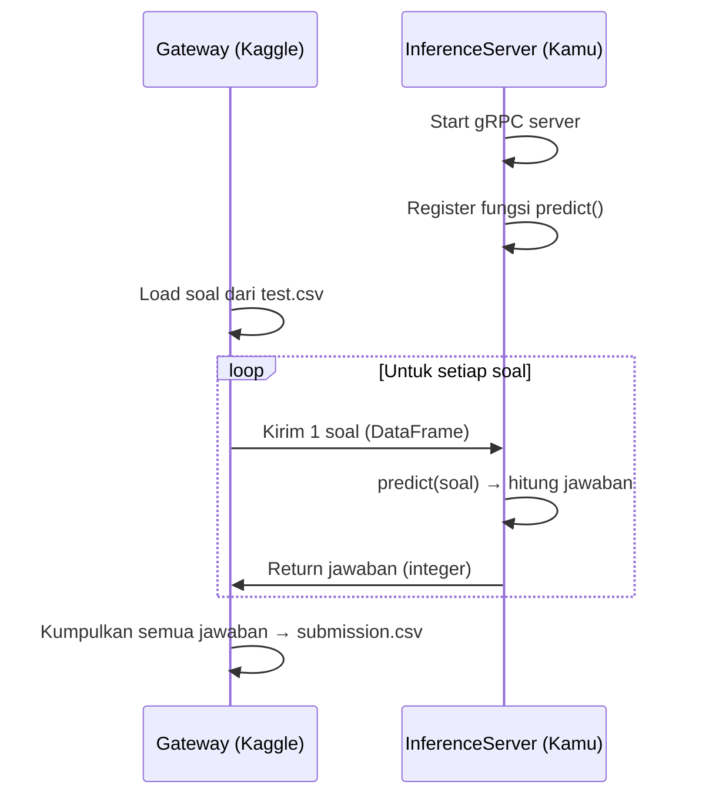

# 🧮 AI Mathematical Olympiad — Progress Prize 3 (AIMO3)

## Apa Kompetisi Ini?

Ini adalah kompetisi Kaggle di mana kamu harus membuat **AI yang bisa menyelesaikan soal-soal Matematika Olimpiade**. Soal-soalnya bukan matematika biasa — ini level olympiad (sangat sulit), meliputi:

- **Teori Bilangan** (modular arithmetic, divisibility, dll)
- **Kombinatorika** (counting, tournament, probabilitas)
- **Geometri** (lingkaran, segitiga, circumcircle, incircle)
- **Aljabar** (fungsi, persamaan, sequence)

Tujuannya: buat notebook Kaggle yang menerima soal matematika dan menghasilkan **jawaban berupa integer (0–99999)**.

---

## Struktur Workspace

```
ai-mathematical-olympiad-progress-prize-3/
├── AIMO3_Reference_Problems.pdf    # Contoh soal referensi (PDF)
├── reference.csv                   # 10 soal referensi + jawaban benar
├── test.csv                        # 3 soal dummy (public test)
├── sample_submission.csv           # Contoh format jawaban
└── kaggle_evaluation/              # API evaluasi dari Kaggle
    ├── __init__.py
    ├── aimo_3_gateway.py           # Gateway: mengirim soal satu-satu
    ├── aimo_3_inference_server.py   # Server: tempat kamu register fungsi predict
    └── core/                       # Internal gRPC communication
        ├── base_gateway.py
        ├── relay.py
        ├── templates.py
        └── generated/              # Proto-generated code
```

---

## Penjelasan File Data

### `test.csv` — Soal (Public Test)

| id     | problem                |
| ------ | ---------------------- |
| 000aaa | What is $1-1$?         |
| 111bbb | What is $0\times10$?   |
| 222ccc | Solve $4+x=4$ for $x$. |

Ini cuma **dummy** untuk testing lokal. Soal asli (private test) jauh lebih sulit.

### `sample_submission.csv` — Format Jawaban

| id     | answer |
| ------ | ------ |
| 000aaa | 0      |
| 111bbb | 0      |
| 222ccc | 0      |

Jawaban harus berupa **integer 0–99999**.

### `reference.csv` — Soal Referensi (10 soal + jawaban)

Berisi 10 soal olimpiade nyata beserta jawabannya. Ini untuk kamu pelajari level kesulitan soal yang akan dihadapi. Contoh:

- Soal tentang **triangle dengan integer side lengths** → jawaban: `336`
- Soal tentang **tournament 2^20 runners** → jawaban: `21818`
- Soal sederhana (Alice & Bob sweets) → jawaban: `50`

---

## Cara Kerja Evaluation API

### Alur Kerja (Arsitektur Client-Server via gRPC)



1. **Kamu** membuat `InferenceServer` dengan fungsi `predict()`
2. **Gateway** (milik Kaggle) membaca soal dari `test.csv`
3. Gateway mengirim soal **satu per satu** (dalam urutan acak) ke server kamu
4. Server kamu menjawab setiap soal, return integer
5. Gateway mengumpulkan semua jawaban menjadi file submission

### Template Notebook yang Harus Kamu Buat

```python
import kaggle_evaluation.aimo_3_inference_server

# Fungsi utama: menerima soal, return jawaban
def predict(id_: str, question: str) -> int:
    # Di sinilah AI kamu bekerja
    # Parse soal, reasoning, hitung jawaban
    answer = solve_math_problem(question)
    return int(answer)  # harus integer 0–99999

# Register dan jalankan server
server = kaggle_evaluation.aimo_3_inference_server.AIMO3InferenceServer(predict)
server.serve()

# Untuk testing lokal:
server.run_local_gateway(data_paths=('test.csv',))
```

---

## Sistem Evaluasi (Scoring)

### Public Leaderboard (selama kompetisi)

- Soal dikirim dalam **urutan acak**
- Skor = **jumlah jawaban benar** (unnormalized accuracy)

### Private Leaderboard (setelah deadline) — **Yang menentukan pemenang**

- Notebook dijalankan **2 kali** pada private test set
- Kedua hasil digabung, lalu dihitung **penalized accuracy**:

| Kondisi                       | Skor per Soal |
| ----------------------------- | ------------- |
| ✅ **Kedua run benar**        | **1.0**       |
| ⚠️ **Satu benar, satu salah** | **0.5**       |
| ❌ **Keduanya salah**         | **0.0**       |

> **Skor total = sum dari skor semua soal**

Konsistensi sangat penting. Kalau model kamu kadang benar kadang salah untuk soal yang sama, skornya lebih rendah.

### Kenapa 2 kali run?

Untuk mencegah jawaban yang "lucky guess". Jika AI benar-benar paham soalnya, harusnya jawaban **konsisten** di kedua run.

---

## Code Requirements (Batasan)

| Batasan           | Detail                                          |
| ----------------- | ----------------------------------------------- |
| **Runtime CPU**   | ≤ 9 jam                                         |
| **Runtime GPU**   | ≤ 5 jam                                         |
| **Internet**      | ❌ Dimatikan (tidak bisa akses internet)        |
| **External Data** | ✅ Boleh pakai data publik & pre-trained models |
| **Format Output** | Harus via API (bukan manual CSV)                |

---

## Perbedaan dengan Progress Prize 1 & 2

| Aspek           | Prize 1 & 2                | **Prize 3**                        |
| --------------- | -------------------------- | ---------------------------------- |
| Rentang jawaban | 0–999 (mod 1000)           | **0–99999**                        |
| Modulo          | Implisit (selalu mod 1000) | **Eksplisit** (disebutkan di soal) |
| Evaluasi final  | 1x run                     | **2x run** (penalized)             |

---

## Ringkasan Detail: Apa yang Perlu Kamu Lakukan

### 1. Buat fungsi `predict()` yang menerima soal dan return jawaban integer

Ini adalah inti dari submission. Fungsi `predict()` dipanggil oleh Gateway Kaggle untuk **setiap soal**, satu per satu:

```python
def predict(id_: str, question: str) -> int:
```

- **Input**: soal matematika dalam format LaTeX/teks (misalnya `"What is the remainder when $abc$ is divided by $10^5$?"`)
- **Output**: integer antara **0–99999**

Fungsi ini harus bisa:

- Mem-_parse_ soal yang mengandung notasi matematika LaTeX
- Memahami apa yang ditanyakan
- Melakukan reasoning / komputasi
- Mengembalikan jawaban final sebagai integer

Kalau jawaban bukan integer atau di luar range 0–99999, submission bisa error.

---

### 2. Gunakan LLM / tool matematika yang bisa reasoning soal olimpiade

Soal-soal di kompetisi ini **sangat sulit** — level International Mathematical Olympiad (IMO). Contoh dari `reference.csv`:

- Soal tentang **tournament 2²⁰ runners** dengan scoring system → butuh kombinatorika tingkat lanjut
- Soal tentang **circumcircle, incircle, Fibonacci** → geometri + number theory
- Soal tentang **fungsi pada integer** dengan constraint `f(m) + f(n) = f(m + n + mn)` → aljabar abstrak

Pendekatan yang bisa digunakan:

| Pendekatan           | Contoh                                     | Kelebihan                                |
| -------------------- | ------------------------------------------ | ---------------------------------------- |
| **LLM Matematika**   | DeepSeek-Math, Qwen2.5-Math, InternLM-Math | Bisa reasoning step-by-step              |
| **Code Interpreter** | Python + SymPy, SageMath                   | Bisa komputasi eksak, modular arithmetic |
| **Hybrid**           | LLM generate kode → eksekusi kode          | Kombinasi reasoning + komputasi          |

Biasanya peserta top menggunakan **hybrid approach**: LLM untuk memahami soal dan menulis solusi Python, lalu **mengeksekusi kode** tersebut untuk mendapatkan jawaban numerik yang tepat.

---

### 3. Bundle model di dalam notebook (karena tidak ada internet)

Saat notebook dijalankan oleh Kaggle, **internet dimatikan total**. Artinya:

- ❌ Tidak bisa `pip install` library baru
- ❌ Tidak bisa download model dari HuggingFace/internet
- ❌ Tidak bisa panggil API OpenAI/Claude/dll

**Solusinya:**

- Upload model sebagai **Kaggle Dataset** (dianggap "publicly available external data", jadi diizinkan)
- Di notebook, load model dari path lokal: `/kaggle/input/nama-dataset/model-files/`
- Semua library yang dibutuhkan harus sudah ter-install di environment Kaggle, atau di-bundle juga

Contoh: kalau pakai model `Qwen2.5-Math-7B`, upload weight-nya sebagai Kaggle Dataset, lalu:

```python
model = AutoModelForCausalLM.from_pretrained("/kaggle/input/qwen-math-7b/")
```

---

### 4. Pastikan efisien — jangan melebihi batas waktu

Batas waktu sangat ketat:

| Tipe             | Batas                 |
| ---------------- | --------------------- |
| **GPU Notebook** | **5 jam** (300 menit) |
| **CPU Notebook** | **9 jam** (540 menit) |

Kalau test set punya misalnya **50 soal**, dan kamu pakai GPU (5 jam):

- Waktu per soal ≈ **6 menit** (max)
- Tapi perlu waktu load model juga (~5-10 menit), jadi waktu efektif per soal lebih sedikit

**Tips efisiensi:**

- Gunakan **quantized model** (4-bit / 8-bit) agar lebih cepat dan hemat VRAM
- Pakai **vLLM** atau **TGI** untuk inference lebih cepat
- Batasi jumlah token yang di-generate per soal
- Set timeout per soal — kalau terlalu lama, skip dan jawab default

---

### 5. Pastikan konsisten — karena dijalankan 2x, jawaban harus reliable

Notebook dijalankan **2 kali** pada private test set. Contoh scoring:

```
Soal X:
  Run 1: jawaban = 42 ✅
  Run 2: jawaban = 42 ✅  → Skor: 1.0

Soal Y:
  Run 1: jawaban = 100 ✅
  Run 2: jawaban = 55  ❌  → Skor: 0.5 (penalti!)

Soal Z:
  Run 1: jawaban = 77  ❌
  Run 2: jawaban = 99  ❌  → Skor: 0.0
```

**Masalah yang bisa bikin inkonsisten:**

- **Random sampling** dari LLM (temperature > 0) → jawaban beda tiap run
- **Timeout** → soal yang berhasil di run 1 mungkin gagal di run 2 karena urutan soal acak
- **Non-deterministic behavior** → floating point, race conditions

**Solusi untuk konsistensi:**

- Set `temperature=0` atau gunakan **greedy decoding** pada LLM
- Set **random seed** yang fixed
- Gunakan **majority voting** (generate beberapa jawaban, ambil yang paling sering muncul) — lebih robust
- Pastikan kode deterministik sebisa mungkin

---

### 6. Submit sebagai Kaggle Notebook menggunakan API yang disediakan

Kamu **tidak bisa** submit file CSV manual. Harus lewat **Kaggle Notebook** yang menggunakan evaluation API. Langkah-langkahnya:

1. **Buat Kaggle Notebook** di halaman kompetisi
2. **Tulis kode** yang mengikuti template:

   ```python
   import kaggle_evaluation.aimo_3_inference_server

   def predict(id_, question):
       # logic kamu di sini
       return answer

   server = kaggle_evaluation.aimo_3_inference_server.AIMO3InferenceServer(predict)
   server.serve()
   ```

3. **Attach model/dataset** sebagai input di notebook
4. **Commit & Submit** — klik tombol "Submit" setelah commit berhasil
5. Kaggle akan menjalankan notebook dengan soal-soal test yang sesungguhnya

> [!IMPORTANT]
> Tombol "Submit" hanya aktif kalau semua code requirements terpenuhi (runtime di bawah limit, internet off, output via API).
